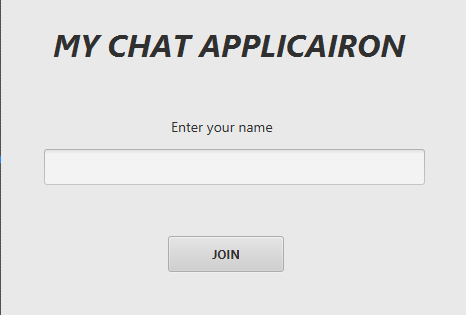
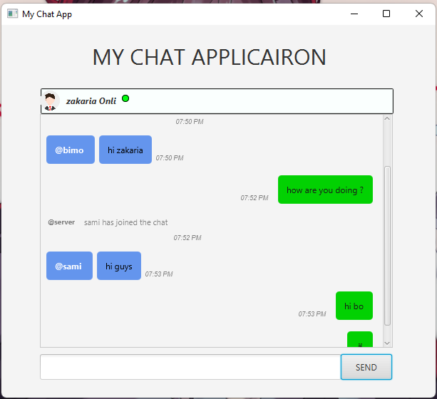

## MY CHAt APPLICATION with javaFx
> A small application which using JavaFX for a GUI chat application.

Currently in Development.

 <h1 align="center">
   
 
   
  Login page
</h1>

 <h1 align="center">
   
 
   
  Chat Page
</h1>

## functional need
- [x] Multi-Client Support
- [x] Username Selection
- [x] MOTD on Connect
- [x] External CSS
- [x] Server GUI
- [x] Time ⌚ of the message
- [x] join notification

## the requirements of this application

> change the port of the in the server Multi Thread class by what you have or what avalible in your 💻 

